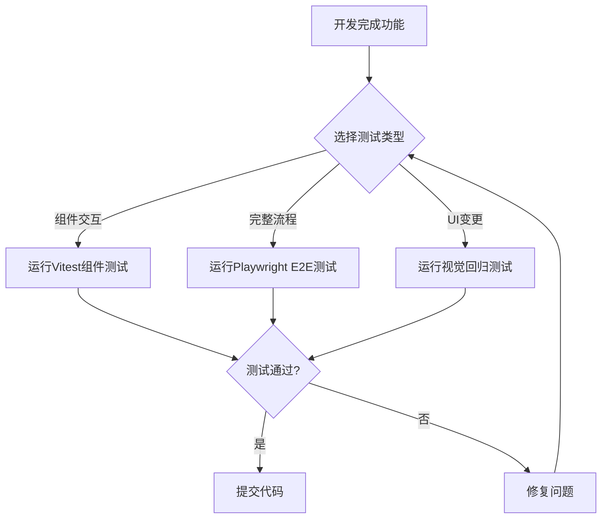

# 界面测试体系设计文档

## 文档信息

| 项目名称 | 异构系统升迁工作量评估系统 (MigraMetric) |
|---------|----------------------------------------|
| 测试类型 | E2E自动化测试 + 视觉回归测试 + 组件交互测试 |
| 设计日期 | 2026-04-07 |
| 技术方案 | Vitest + Playwright全家桶 |
| 文档版本 | V1.0 |

---

## 一、设计目标

### 1.1 核心目标

建立一套完整的界面测试体系，实现质量左移，在本地开发阶段即可验证界面质量。

### 1.2 测试范围

- **页面覆盖**：全部23个Vue页面 + 通用组件
- **测试深度**：每个页面全面测试套件（10-20个测试用例）
- **测试类型**：组件交互测试、E2E自动化测试、视觉回归测试

### 1.3 质量标准

- **组件交互测试**：覆盖率 > 90%，运行时间 < 1秒/用例
- **E2E测试**：核心流程覆盖率 100%，运行时间 < 10秒/用例
- **视觉回归测试**：关键页面快照完整，差异检测准确率 > 95%

---

## 二、技术架构

### 2.1 技术选型

| 测试类型 | 工具组合 | 版本要求 | 选型理由 |
|---------|---------|---------|---------|
| 组件交互测试 | Vitest + @vue/test-utils | Vitest ^1.2.1 | 基于现有技术栈，学习成本低 |
| E2E自动化测试 | Playwright | ^1.40.0 | 与Vitest深度集成，功能全面 |
| 视觉回归测试 | Playwright + 快照对比 | ^1.40.0 | 原生快照功能，无需额外依赖 |

### 2.2 架构设计

```
测试触发层（手动触发）
    ↓
测试类型层（3种测试）
    ├─ 组件交互测试（Vitest + jsdom）
    ├─ E2E自动化测试（Playwright + 真实浏览器）
    └─ 视觉回归测试（Playwright + 快照对比）
    ↓
测试执行层（统一Test Runner）
    ↓
环境依赖层（真实后端 + MySQL）
```

### 2.3 测试流程



---

## 三、目录结构

### 3.1 测试文件组织

```
migrametric-web/
├── src/
│   ├── views/
│   │   ├── login/
│   │   │   ├── index.vue
│   │   │   ├── Login.test.ts              # 单元测试
│   │   │   └── Login.interaction.test.ts   # 组件交互测试
│   │   └── ... (其他页面)
│   └── components/
│       └── ... (组件测试)
│
├── tests/
│   ├── e2e/                                # E2E测试
│   │   ├── auth/
│   │   │   └── login.spec.ts
│   │   ├── project/
│   │   │   ├── create-project.spec.ts
│   │   │   └── ...
│   │   └── ...
│   │
│   ├── visual/                             # 视觉回归测试
│   │   ├── pages/
│   │   │   ├── login.spec.ts
│   │   │   └── ...
│   │   └── snapshots/
│   │
│   ├── fixtures/                           # 测试数据
│   │   ├── users.ts
│   │   └── projects.ts
│   │
│   ├── utils/                              # 测试工具
│   │   ├── test-helpers.ts
│   │   ├── api-helpers.ts
│   │   └── auth-helpers.ts
│   │
│   └── setup/                              # 测试初始化
│       ├── e2e-setup.ts
│       └── global-setup.ts
│
├── playwright.config.ts
├── vitest.config.ts
└── package.json
```

### 3.2 命名规范

| 测试类型 | 命名格式 | 位置 | 示例 |
|---------|---------|------|------|
| 单元测试 | `*.test.ts` | 同源文件 | `Login.test.ts` |
| 组件交互 | `*.interaction.test.ts` | 同源文件 | `Login.interaction.test.ts` |
| E2E测试 | `*.spec.ts` | `tests/e2e/` | `login.spec.ts` |
| 视觉测试 | `*.spec.ts` | `tests/visual/` | `login.spec.ts` |

---

## 四、配置设计

### 4.1 Vitest配置扩展

```typescript
// vitest.config.ts
export default defineConfig({
  plugins: [vue()],
  test: {
    globals: true,

    // 项目配置：分离不同测试类型
    projects: [
      {
        test: {
          name: 'unit',
          include: ['src/**/*.test.ts'],
          environment: 'jsdom',
        }
      },
      {
        test: {
          name: 'interaction',
          include: ['src/**/*.interaction.test.ts'],
          environment: 'jsdom',
          setupFiles: ['./tests/setup/component-setup.ts'],
        }
      },
      {
        test: {
          name: 'e2e',
          include: ['tests/e2e/**/*.spec.ts'],
          setupFiles: ['./tests/setup/e2e-setup.ts'],
        }
      },
      {
        test: {
          name: 'visual',
          include: ['tests/visual/**/*.spec.ts'],
          setupFiles: ['./tests/setup/visual-setup.ts'],
        }
      }
    ]
  }
})
```

### 4.2 Playwright配置

```typescript
// playwright.config.ts
import { defineConfig, devices } from '@playwright/test'

export default defineConfig({
  testDir: './tests',
  fullyParallel: true,
  forbidOnly: !!process.env.CI,

  // 本地开发配置
  use: {
    baseURL: 'http://localhost:3000',
    trace: 'retain-on-failure',
    screenshot: 'only-on-failure',
  },

  // 项目配置
  projects: [
    {
      name: 'e2e',
      testDir: './tests/e2e',
      use: { ...devices['Desktop Chrome'] },
    },
    {
      name: 'visual',
      testDir: './tests/visual',
      use: { ...devices['Desktop Chrome'] },
    },
  ],

  // 本地开发无需webServer，手动启动
})
```

### 4.3 Package.json脚本

```json
{
  "scripts": {
    "test": "vitest",
    "test:unit": "vitest --project=unit",
    "test:interaction": "vitest --project=interaction",
    "test:e2e": "vitest --project=e2e",
    "test:visual": "vitest --project=visual",
    "test:all": "vitest --run",
    "test:coverage": "vitest run --coverage",

    // Playwright命令（备用）
    "playwright:test": "playwright test",
    "playwright:ui": "playwright test --ui",
    "playwright:debug": "playwright test --debug"
  }
}
```

---

## 五、测试数据管理

### 5.1 测试用户数据

```typescript
// tests/fixtures/users.ts
export const testUsers = {
  admin: {
    id: 1,
    username: 'admin',
    password: 'admin123',
    name: '管理员',
    role: 'ADMIN',
    email: 'admin@example.com'
  },
  user: {
    id: 2,
    username: 'testuser',
    password: 'test123',
    name: '测试用户',
    role: 'USER',
    email: 'user@example.com'
  }
}
```

### 5.2 测试项目数据

```typescript
// tests/fixtures/projects.ts
export const testProjects = {
  draft: {
    id: 1,
    projectName: '测试草稿项目',
    customerName: '测试客户A',
    status: 'DRAFT'
  },
  inProgress: {
    id: 2,
    projectName: '进行中项目',
    customerName: '测试客户B',
    status: 'IN_PROGRESS'
  }
}
```

### 5.3 数据库初始化

```typescript
// tests/utils/db-helpers.ts
export async function setupTestDatabase() {
  // 清空测试数据库
  // 插入测试数据
  // 返回数据库连接
}

export async function cleanupTestDatabase() {
  // 清理测试数据
}
```

---

## 六、测试工具函数

### 6.1 认证辅助函数

```typescript
// tests/utils/auth-helpers.ts
import { testUsers } from '../fixtures/users'

export async function login(page, userType = 'admin') {
  const user = testUsers[userType]
  await page.goto('/login')
  await page.fill('[data-testid="username"]', user.username)
  await page.fill('[data-testid="password"]', user.password)
  await page.click('[data-testid="login-button"]')
  await page.waitForURL('/dashboard')
}

export async function logout(page) {
  await page.click('[data-testid="user-menu"]')
  await page.click('[data-testid="logout-button"]')
  await page.waitForURL('/login')
}
```

### 6.2 API辅助函数

```typescript
// tests/utils/api-helpers.ts
const API_BASE = 'http://localhost:8080/api'

export async function createProjectViaAPI(projectData) {
  const response = await fetch(`${API_BASE}/projects`, {
    method: 'POST',
    headers: { 'Content-Type': 'application/json' },
    body: JSON.stringify(projectData)
  })
  return response.json()
}

export async function deleteProjectViaAPI(projectId) {
  await fetch(`${API_BASE}/projects/${projectId}`, {
    method: 'DELETE'
  })
}
```

### 6.3 测试辅助函数

```typescript
// tests/utils/test-helpers.ts
export function waitForLoadingComplete(page) {
  return Promise.all([
    page.waitForSelector('.loading-skeleton', { state: 'hidden' }),
    page.waitForSelector('[data-testid="loading"]', { state: 'hidden' })
  ])
}

export async function takeSnapshot(page, name) {
  await page.screenshot({
    path: `tests/visual/snapshots/${name}.png`,
    fullPage: true
  })
}
```

---

## 七、测试用例设计示例

### 7.1 登录页面测试矩阵

#### 组件交互测试（10个用例）

| ID | 测试场景 | 预期结果 |
|----|---------|---------|
| INT-001 | 正确用户名密码登录 | 跳转到仪表盘 |
| INT-002 | 错误密码登录 | 显示错误提示 |
| INT-003 | 空用户名提交 | 表单验证失败 |
| INT-004 | 空密码提交 | 表单验证失败 |
| INT-005 | 记住密码勾选 | 下次自动填充 |
| INT-006 | 密码可见性切换 | 显示/隐藏密码 |
| INT-007 | Enter键提交 | 触发登录 |
| INT-008 | 快速连续点击 | 防重复提交 |
| INT-009 | Token自动保存 | localStorage存储 |
| INT-010 | 网络错误处理 | 显示网络错误提示 |

#### E2E测试（15个用例）

| ID | 测试场景 | 测试步骤 | 预期结果 |
|----|---------|---------|---------|
| E2E-001 | 完整登录流程 | 输入用户名密码→点击登录 | 成功跳转仪表盘 |
| E2E-002 | 错误密码3次锁定 | 连续3次错误密码 | 账户锁定提示 |
| E2E-003 | Session过期处理 | Token过期后访问页面 | 跳转登录页 |
| E2E-004 | 多设备登录 | 同账号不同浏览器登录 | 提示已在其他设备登录 |
| E2E-005 | 登出流程 | 点击登出 | 清除Token，跳转登录页 |
| E2E-006 | 自动登录 | 勾选记住密码，关闭浏览器重新打开 | 自动登录 |
| E2E-007 | 浏览器后退拦截 | 登录后点击浏览器后退 | 停留在当前页 |
| E2E-008 | 已登录访问登录页 | 已登录状态访问/login | 自动跳转仪表盘 |
| E2E-009 | 权限验证失败 | 普通用户访问管理接口 | 403错误提示 |
| E2E-010 | 密码强度提示 | 输入弱密码 | 显示强度提示 |
| E2E-011 | 验证码功能（如有） | 显示验证码 | 验证码正确验证 |
| E2E-012 | 手机号登录（如有） | 使用手机号登录 | 登录成功 |
| E2E-013 | 第三方登录（如有） | 点击第三方登录按钮 | 跳转第三方授权 |
| E2E-014 | 忘记密码流程 | 点击忘记密码 | 跳转找回密码页 |
| E2E-015 | 登录日志记录 | 登录成功后检查日志 | 记录登录时间和IP |

#### 视觉回归测试（5个场景）

| ID | 测试场景 | 快照类型 |
|----|---------|---------|
| VIS-001 | 登录页初始状态 | 全页快照 |
| VIS-002 | 表单填写状态 | 表单区域快照 |
| VIS-003 | 错误提示状态 | 错误提示快照 |
| VIS-004 | 加载状态 | 加载按钮快照 |
| VIS-005 | 移动端响应式 | 375px宽度快照 |

---

## 八、实施计划

### 8.1 分阶段实施

**第1阶段：基础建设（1-2天）**
- 安装Playwright依赖
- 配置vitest.config.ts和playwright.config.ts
- 创建测试目录结构
- 编写测试工具函数

**第2阶段：组件交互测试（3-5天）**
- 为23个页面编写组件交互测试
- 每个页面10个测试用例
- 总计约230个测试用例

**第3阶段：E2E测试（5-7天）**
- 为关键业务流程编写E2E测试
- 每个页面15个测试用例
- 总计约345个测试用例

**第4阶段：视觉回归测试（2-3天）**
- 为关键页面创建视觉快照基线
- 配置快照对比策略
- 建立视觉测试工作流

**第5阶段：集成优化（1-2天）**
- 优化测试执行速度
- 完善测试报告
- 编写测试使用文档

### 8.2 资源需求

- **开发人员投入**：每人每天2-4小时测试编写
- **测试环境**：本地开发环境 + 测试数据库
- **工具依赖**：Vitest、Playwright、相关插件

---

## 九、质量保障

### 9.1 测试覆盖率目标

- 组件交互测试：> 90%
- E2E测试：核心流程 100%
- 视觉回归：关键页面 100%

### 9.2 性能要求

- 组件交互测试：单用例 < 1秒
- E2E测试：单用例 < 10秒
- 完整测试套件：< 10分钟

### 9.3 维护策略

- 定期更新快照基线
- 及时修复失败测试
- 持续补充新功能测试

---

## 十、风险与缓解

### 10.1 潜在风险

| 风险 | 影响 | 缓解措施 |
|------|------|---------|
| 测试数据冲突 | E2E测试失败 | 使用独立测试数据库，每次运行清理数据 |
| 测试运行时间长 | 影响开发效率 | 并行执行测试，增量测试策略 |
| 快照频繁变化 | 视觉测试不稳定 | 仅在UI确实变更时更新快照 |
| 环境依赖 | 测试环境不稳定 | 提供环境检查脚本，明确依赖说明 |

### 10.2 应急预案

- 测试失败时提供详细日志和截图
- 提供跳过测试的临时方案（仅限开发调试）
- 建立测试问题快速响应机制

---

## 十一、成功标准

### 11.1 交付成果

- ✅ 完整的测试配置文件
- ✅ 230+ 组件交互测试用例
- ✅ 345+ E2E测试用例
- ✅ 视觉回归测试基线
- ✅ 测试工具函数库
- ✅ 测试使用文档

### 11.2 验收标准

- 所有测试用例可正常运行
- 测试覆盖率达标
- 测试执行时间符合预期
- 开发人员可独立使用测试体系

---

**设计完成日期**：2026-04-07
**下一步**：编写实现计划，开始代码实施